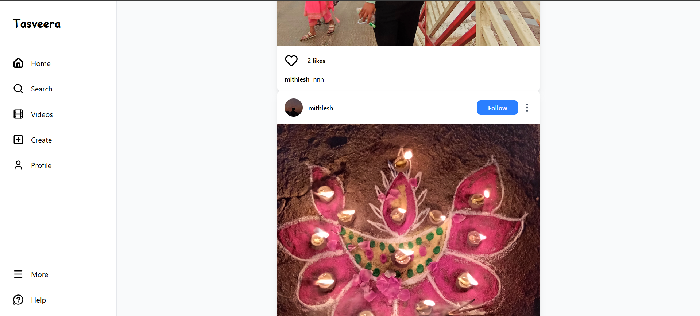
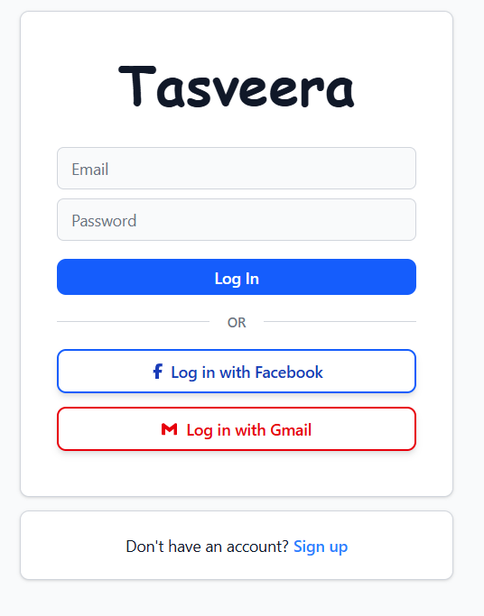
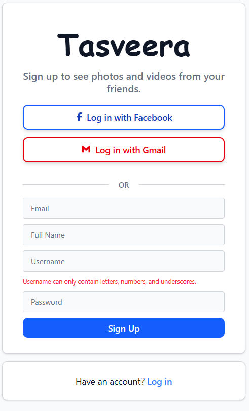

# 📸 Tasveera – Frame Stories


## 🚀 Project Overview

Tasveera – Frame Stories is a full-stack social media web application built using the MERN stack where users can share their memories through photos and videos, follow other users, and interact with posts.

This is a solo full-stack portfolio project built to strengthen real-world MERN skills and work with production-level tools like Cloudinary and MongoDB Atlas.


## ✨ Features

### 🔐 Authentication
- Email and password login/signup
- Username support
- Password hashing using bcrypt
- Google login
- Facebook login
- JWT based authentication
- Protected routes
- Logout functionality

### 🖼️ Posts
- Upload image or video posts
- Add captions to posts
- Media stored using Cloudinary
- Only media URLs stored in database

### 📰 Feed
- Latest posts shown first
- Infinite scrolling feed
- Smooth loading experience

### ❤️ Interactions
- Like and unlike posts
- Double-click to like
- Like count display
- Pause and play videos

### 👥 Follow System
- Follow and unfollow users
- Follow from profile or post
- Visit profile by clicking username

### 🔍 Search
- Search users by username
- Live search with debouncing

### 👤 Profiles
- Profile photo
- Bio
- Followers and following count
- User posts shown in grid
- Follow/unfollow button on other profiles
- Edit profile option on own profile


## 🛠 Tech Stack

### Frontend
- React (Vite)
- Tailwind CSS
- Axios
- React Router DOM
- Lucide Icons / React Icons

### Backend
- Node.js
- Express.js
- JWT authentication
- Cookies and sessions
- Multer for file handling
- Custom authentication and upload middleware

### Database
- MongoDB Atlas
- Mongoose ODM

### Media Storage
- Cloudinary


## 📁 Project Structure

- /frontend → React frontend
- /backend → Express backend


## 🖥️ Screenshots

### Home Feed


### Profile Page


### Upload Post


### LogIn & SignUp
<table align="center">
  <tr>
    <td style="padding:25px;">
      
    </td>
    <td style="padding:25px;">
      
    </td>
  </tr>
</table>
## ⚙️ Installation and Setup

### Clone Repository

```bash
git clone https://github.com/Mithlesh-15/tasveera-FrameStories.git

cd tasveera-FrameStories
```

### Backend Setup
```bash
cd backend
npm install
npm run dev
npm run start
```

Create .env using env.example.

### Frontend Setup
```bash
cd frontend
npm install
npm run dev
```


## 🔐 Environment Variables

### Backend
```
PORT=
DEFAULT_PROFILE_PIC=
MONGO_URI=
JWT_SECRET=
CLOUDINARY_CLOUD_NAME=
CLOUDINARY_API_KEY=
CLOUDINARY_API_SECRET=
```

### Frontend
```
VITE_API_KEY=
VITE_AUTH_DOMAIN=
VITE_PROJECT_ID=
VITE_STORAGE_BUCKET=
VITE_MESSAGING_SENDER_ID=
VITE_APP_ID=
VITE_MEASUREMENT_ID=
```


## 🌍 Deployment
- Frontend deployed on Netlify
- Backend deployed on Vercel
- Database hosted on MongoDB Atlas


## 🔮 Future Enhancements
- Real-time chat using Socket.io
- Notification system


## 👨‍💻 Author

Mithlesh Kumar Dewangan  
Student | Full Stack Developer (MERN)

- GitHub: https://github.com/Mithlesh-15
- LinkedIn: https://www.linkedin.com/in/mithlesh-kumar-dewangan-li15
- Twitter (X): https://x.com/mithlesh__15
- Email: kamaldewangan367@gmail.com
